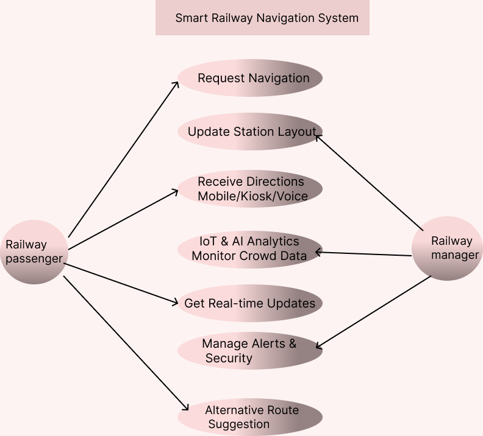

# Smart India Hackathon Workshop
# Date:28/02/2024
## Register Number: 212223220101
## Name: SARANYA S.
## Problem Title
SIH 1710: Enhancing Navigation for Railway Station Facilities and Locations
## Problem Description
Background: Railway stations are complex environments with numerous facilities and locations such as ticket counters, platforms, restrooms, food courts, and waiting areas. Passengers often face difficulties in navigating these spaces, especially in large or unfamiliar stations. Efficient and user-friendly navigation systems are crucial for improving passenger experience, reducing congestion, and ensuring timely travel connections. Description: The problem involves developing a comprehensive navigation solution for railway stations that assists passengers in locating various facilities and destinations within the station premises. This includes creating detailed maps, providing real-time directions, and integrating features such as accessibility options for individuals with disabilities. The solution should be intuitive, easy to use, and accessible via multiple platforms, including mobile devices and digital kiosks. Key challenges include updating navigation information in real-time, ensuring accuracy, and accommodating the diverse needs of all passengers. Expected Solution: The expected solution is a multi-platform navigation system that provides detailed, real-time directions to all facilities and locations within a railway station. This system should include: A mobile application with 3D interactive maps and step-by-step navigation. Digital kiosks located throughout the station with touch-screen interfaces. Voice-guided navigation for visually impaired passengers. Regular updates to reflect changes in station layout and facility locations. Integration with existing railway apps and services for seamless user experience. The solution should enhance the overall passenger experience by reducing confusion, saving time, and improving accessibility within the station.

## Problem Creater's Organization
Ministry of Railway

## Idea

Smart Railway Navigation System Idea
Navigating railway stations can be confusing, especially for new travelers and differently-abled passengers. Our Smart Railway Navigation System offers real-time navigation via a mobile app and digital kiosks, guiding users to platforms, ticket counters, and other facilities.

Using IoT sensors, AI, and beacons, the system detects crowd congestion and suggests alternative routes for smoother movement. It also provides voice-guided navigation for the visually impaired and sends alerts for platform changes, train delays, and emergencies.

A Railway Admin Dashboard helps authorities track crowds and update layouts, ensuring an efficient, accessible, and stress-free travel experience. 🚆📍

## Proposed Solution / Architecture Diagram

.png>)

## Use Cases

## Technology Stack

- **Mobile App**: React Native / Flutter  
- **Backend**: Node.js / Django / Firebase  
- **Database**: PostgreSQL / MongoDB / Firebase Firestore  
- **Maps & Navigation**: Google Maps API / OpenStreetMap  
- **AI/ML for Predictive Analysis**: TensorFlow / OpenCV  
- **Cloud Services**: AWS / Google Cloud / Azure  
- **IoT for Real-time Updates**: RFID, Beacons, or GPS Sensors  

## Dependencies

1.Railway API Integration – For fetching real-time train schedules and platform updates.
2.Government Database Access – To keep station layout and facility details up-to-date.
3.Cloud Storage – To store user data, navigation history, and real-time updates.
4.IoT Devices – For tracking footfall, detecting congestion, and providing live updates.
5.Multi-Language Support – To cater to passengers across different regions.

